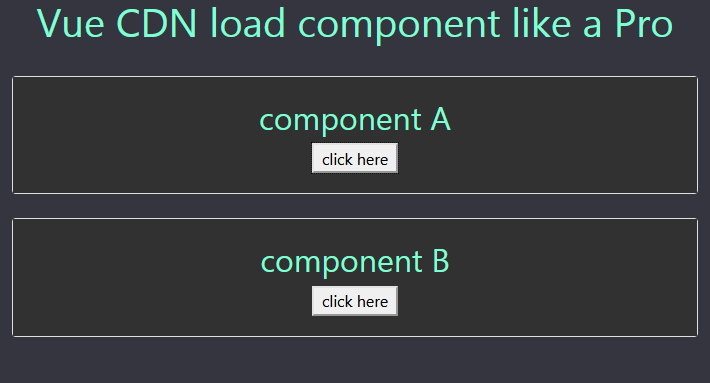

# Vue-CDN-load-component
No need for Node js or npm or any other tool ...

just download / clone this project and run index.html

you can use this project as a boilerplate for your new projects...

___

___

Now that it works like magic , you can explore the content of the index.html and see how components are loaded

of course you are free to use any architecture you'd like , but I kept everything on root directory to keep it simple .